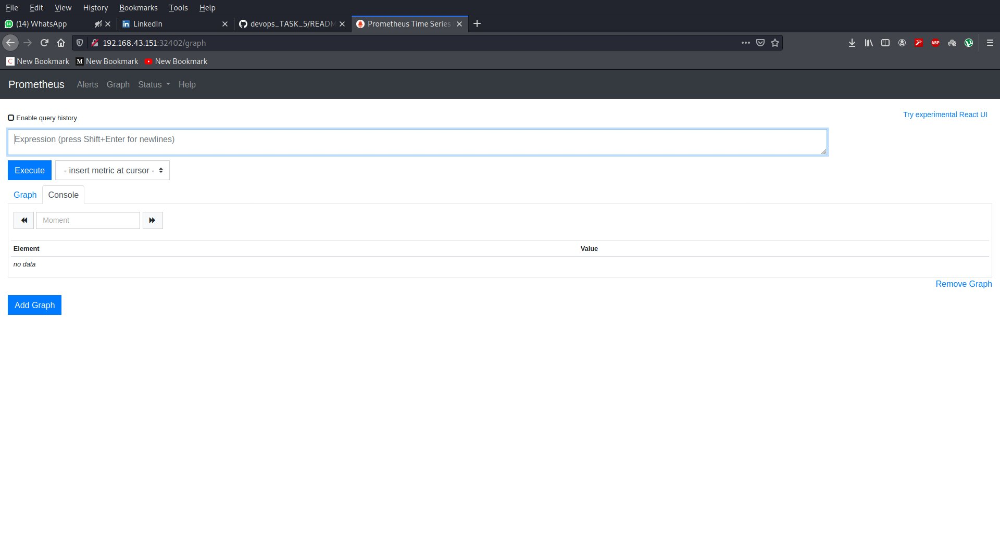
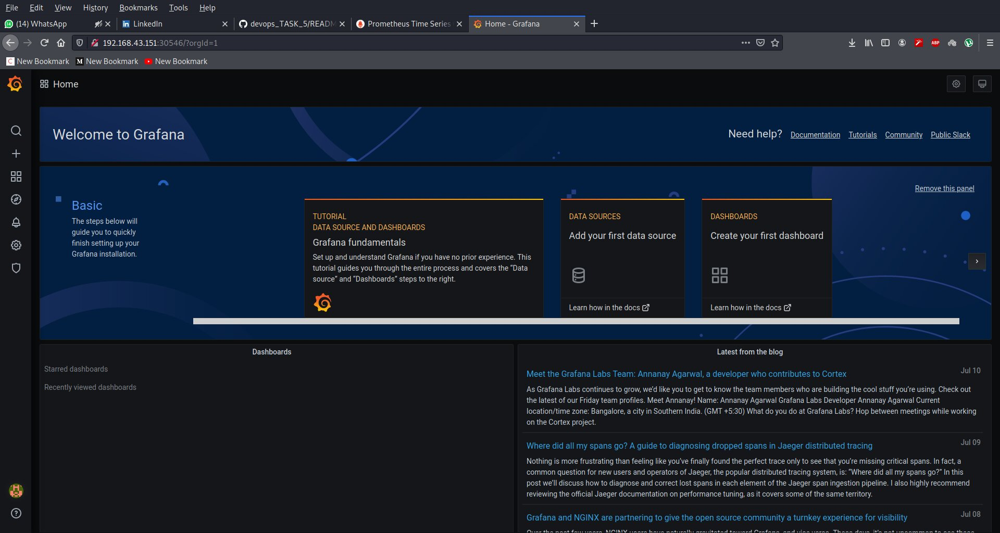

# Monitoring using Prometheus and Grafana
### Monitoring is a necessity in today’s world.
### Here i use Prometheus and Grafana for monitoring our system. Prometheus use for store the metrics and  Grafana is represent in vitual 


## So here we perform below task 

### Integrate Prometheus and Grafana and perform in following way:
### 1. Deploy them as pods on top of Kubernetes by creating resources Deployment, ReplicaSet, Pods or Services
### 2. And make their data to be remain persistent
### 3. And both of them should be exposed to outside world.

### so here push my docker images of Prometheus and Grafana on top of my docker hub account

## Create a Service for Prometheus
### by default prometheus use port 9090 , so we expose it using service ,so public can access this prometheus 
```
--- 
apiVersion: v1
kind: Service
metadata: 
  lables: 
    app: prom
  name: prom-svc
spec: 
  ports: 
    - 
      port: 9090
      
  selector: 
    app: prom
  type: NodePort
---
```

## Create a PersistentVolumeClaim for Prometheus
```
---
apiVersion: v1
kind: PersistentVolumeClaim
metadata: 
  lables:
    app: prom
  name: prom-vol
spec: 
  accessModes: 
    - ReadWriteOnce
  resources: 
    requests: 
      storage: 3Gi
 ---
 ```
 ### here i create a PVC it is Dynamically ceate a PV for us so we don't have create pv manually
 ### i am create single file for creating all resoures for k8s deployment by separet by --- otherwise some time faild to deploy 
## ConfigMap for Prometheus

### A ConfigMap is an API object that lets you store configuration for other objects to use. Unlike most Kubernetes objects that have a spec , a ConfigMap has a ### data section to store items (keys) and their values. The name of a ConfigMap must be a valid DNS subdomain name.
### Using the configmap different ways ,that you can use a ConfigMap to configure a container inside a Pod
### config map use according to you need without config map you can create deployment 
```
apiVersion: v1
data: 
  prometheus.yml: |
      global:
        scrape_interval: 15s
        evaluation_interval: 15s
      alerting:
        alertmanagers:
        - static_configs:
          - targets:
      rule_files:
      scrape_configs:
      - job_name: ‘prometheus’
        
        static_configs:
        - targets: [‘127.0.0.1:9090’]
kind: ConfigMap
metadata: 
  labels: 
    app: prom
  name: prom-config
  ```

 ## Create Deployment for  Prometheus 
 ### here i create deployment and i attach the service and pvc with deplyment 
 ### For creating container  i add my docker image .
 ```
 
 apiVersion: apps/v1
kind: Deployment
metadata: 
  labels: 
    app: prom
  name: prom-deploy
spec: 
  selector: 
    matchLabels: 
      app: prom
  template: 
    metadata: 
      labels: 
        app: prom
      name: prom-deploy
    spec: 
      containers: 
        - 
          image: 9057508163/prometheus
          name: prometheus
          ports: 
            - 
              containerPort: 9090
          volumeMounts: 
            - 
              mountPath: /etc/prometheus/prometheus.yml
              name: prom-config
              subPath: prometheus.yml
            - 
              mountPath: /prometheus
              name: prom-vol
      volumes: 
        - 
          name: prom-vol
          persistentVolumeClaim: 
            claimName: prom-vol
        - 
          name: prom-config
          configMap: 
            name: prom-config
          
---
```
## create Infrastructure for prometheus ,so we launch the yml file 
#### you can use Kustomization File luanch the Infrastructure 
```
root@vishnu:/vv/prom# kubectl apply -f prometheus.yml --validate=false
service/prom-svc created
persistentvolumeclaim/prom-vol created
configmap/prom-config created
deployment.apps/prom-deploy created
root@vishnu:/vv/prom# 
```
## After  creating Infrastructure
```
root@vishnu:/vv/prom# kubectl get all
NAME                               READY   STATUS    RESTARTS   AGE
pod/prom-deploy-59d7875d77-m5fz5   1/1     Running   0          16m

NAME                 TYPE        CLUSTER-IP      EXTERNAL-IP   PORT(S)          AGE
service/kubernetes   ClusterIP   10.96.0.1       <none>        443/TCP          22m
service/prom-svc     NodePort    10.107.90.133   <none>        9090:32402/TCP   16m

NAME                          READY   UP-TO-DATE   AVAILABLE   AGE
deployment.apps/prom-deploy   1/1     1            1           16m

NAME                                     DESIRED   CURRENT   READY   AGE
replicaset.apps/prom-deploy-59d7875d77   1         1         1       16m

--------------------------

root@vishnu:/vv/prom# kubectl get pvc
NAME       STATUS   VOLUME                                     CAPACITY   ACCESS MODES   STORAGECLASS   AGE
prom-vol   Bound    pvc-a5ab653d-d283-4480-a340-c3f9cbd1beeb   3Gi        RWO            standard       23m

---------------------------------
root@vishnu:/vv/prom# kubectl get pv
NAME                                       CAPACITY   ACCESS MODES   RECLAIM POLICY   STATUS   CLAIM              STORAGECLASS   REASON   AGE
pvc-a5ab653d-d283-4480-a340-c3f9cbd1beeb   3Gi        RWO            Delete           Bound    default/prom-vol   standard                23m
```

### When i run kubectl apply command without  --validate=false then it give some validation error so i use --validate=false

## Create a Service for Grafana
### by default Grafana use port 3000 , so we expose it using service ,so public can access this prometheus 
### for creating service for Grafana is same as Prometheus service
```
apiVersion: v1
kind: Service
metadata: 
  labels: 
    app: graf
  name: grafana-svc
spec: 
  ports: 
    -
      port: 3000
  selector: 
    app: graf
  type: NodePort
  ```

## Create a PersistentVolumeClaim for Grafana
```
apiVersion: v1
kind: PersistentVolumeClaim
metadata: 
  lables:
    app: graf
  name: grafana-pvc
spec: 
  accessModes: 
    - ReadWriteOnce
  resources: 
    requests: 
      storage: 2Gi
```
## Create Deployment for  Prometheus 

```
apiVersion: apps/v1
kind: Deployment
metadata: 
  labels: 
    app: graf
  name: grafana-deploy
spec: 

  selector: 
    matchLabels: 
      app: graf
  strategy: 
    type: Recreate
  template: 
    metadata: 
      labels: 
        app: graf
      name: grafana-deploy
    spec: 
      containers: 
        - 
          image: 9057508163/grafana
          name: graf
          ports: 
            - 
              containerPort: 3000
          volumeMounts: 
            - 
              mountPath: /var/lib/grafana
              name: grafana-vol
      volumes: 
        - 
          name: grafana-vol
          persistentVolumeClaim: 
            claimName: grafana-pvc

```
## create Infrastructure for grafana ,so we launch the yml file 

```
root@vishnu:/vv/grafana# kubectl apply -f grafana.yml --validate=false
service/grafana-svc created
persistentvolumeclaim/grafana-pvc created
deployment.apps/grafana-deploy created
root@vishnu:/vv/grafana# 

```
## After Infrastructure creation
```
root@vishnu:/vv/grafana# kubectl get all
NAME                                  READY   STATUS    RESTARTS   AGE
pod/grafana-deploy-649dbc9cd6-7x6md   1/1     Running   0          3m30s
pod/prom-deploy-59d7875d77-m5fz5      1/1     Running   0          29m

NAME                  TYPE        CLUSTER-IP      EXTERNAL-IP   PORT(S)          AGE
service/grafana-svc   NodePort    10.106.163.97   <none>        3000:30546/TCP   3m30s
service/kubernetes    ClusterIP   10.96.0.1       <none>        443/TCP          35m
service/prom-svc      NodePort    10.107.90.133   <none>        9090:32402/TCP   29m

NAME                             READY   UP-TO-DATE   AVAILABLE   AGE
deployment.apps/grafana-deploy   1/1     1            1           3m30s
deployment.apps/prom-deploy      1/1     1            1           29m

NAME                                        DESIRED   CURRENT   READY   AGE
replicaset.apps/grafana-deploy-649dbc9cd6   1         1         1       3m30s
replicaset.apps/prom-deploy-59d7875d77      1         1         1       29m
root@vishnu:/vv/grafana# 
```


